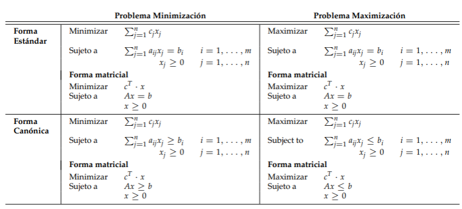

# Ensayos metaheuristica

## Resumen de planteamiento de problemas

La tabla anterior fue tomada de las diapositivas de Botero: [Programación entera y algoritmos de mejora](https://udeaeduco-my.sharepoint.com/personal/juanf_botero_udea_edu_co/_layouts/15/onedrive.aspx?id=%2Fpersonal%2Fjuanf%5Fbotero%5Fudea%5Fedu%5Fco%2FDocuments%2FUniversidad%20de%20Antioquia%2FTecnicasOptimizacion%2FContenido%2FOptimizaci%C3%B3nLineal%2FClase3%2Fclase3%2Epdf&parent=%2Fpersonal%2Fjuanf%5Fbotero%5Fudea%5Fedu%5Fco%2FDocuments%2FUniversidad%20de%20Antioquia%2FTecnicasOptimizacion%2FContenido%2FOptimizaci%C3%B3nLineal%2FClase3&ga=1)

## Problemas de aplicacion

1. Problema de la mochila ([link](problema_mochila/README.md))
2. Problema del viajero (Aun no se ha hecho)

## Referencias

1. https://github.com/cjbt/Free-Algorithm-Books/tree/master/book
2. https://github.com/egonSchiele/grokking_algorithms
3. https://github.com/rishal-hurbans/Grokking-Artificial-Intelligence-Algorithms
4. http://am121.seas.harvard.edu/site/wp-content/uploads/2014/08/latex_snippets.pdf
5. https://orcomplete.com/computer/sertalpbilal/latex-templates-for-optimization-models
6. https://ashki23.github.io/markdown-latex.html

