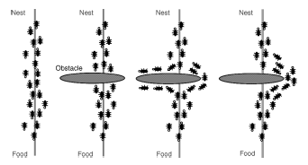
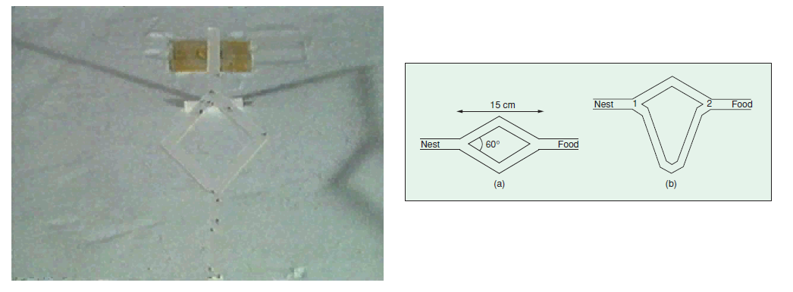
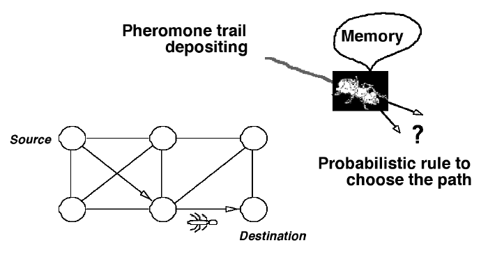
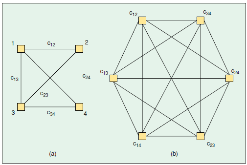

# Hormigas

## Algunos apuntes sobre las hormigas

> [!warning]
> Estos son solo apuntes tomados al chapotear lecturas por varios lados

## Definición ACO

Es un algoritmo de optimización inspirado en el comportamiento de las hormigas cuando buscan comida. Se utiliza para resolver problemas computacionales complejos, como encontrar la ruta más corta en una red (similar al problema del viajante). 

## Aspectos relacionados con la biologia

Las ideas en biologia que se buscan implementar son las siguientes:
1. **El comportamiento individual - ¿Qué hace una sola hormiga cuando busca comida?**
   
   Una hormiga sola actúa de forma muy simple, casi aleatoria. Cuando sale a buscar comida, explora su entorno. Si encuentra una fuente de alimento, toma una porción y emprende el camino de regreso al nido. Mientras regresa, va depositando una sustancia química en el suelo. Su comportamiento es una mezcla de exploración y seguimiento de "pistas".

2. **La comunicación química - ¿Qué son las feromonas y cómo funcionan como "pistas" para las demás?**
   
   Esta es la clave de todo. La sustancia que las hormigas depositan se llama **feromona**. Funciona como un mensaje para las demás. Otras hormigas pueden oler este rastro y decidir seguirlo. Un punto crucial es que la feromona se evapora con el tiempo. Esto significa que los rastros más antiguos o menos usados tienden a desaparecer.

3. **La inteligencia colectiva**: ¿Cómo la suma de comportamientos simples da lugar a una solución inteligente para toda la colonia?
   
   La inteligencia no está en una sola hormiga, sino en el sistema completo. Imagina dos caminos hacia la comida, uno corto y uno largo. Las hormigas que, por azar, toman el camino corto, volverán antes al nido. Esto hace que refuercen ese camino con más feromonas en menos tiempo. El camino corto acumula feromona más rápido de lo que se evapora, volviéndose muy atractivo, mientras que el camino largo se debilita. Al final, toda la colonia prefiere el camino más eficiente sin que nadie lo haya planeado centralmente. Este fenómeno se llama **estigmergia**: una comunicación indirecta a través de modificaciones en el ambiente.

Si yo fuera una hormiga que fuera parte de un nido y necesitara buscar comida sin saber por donde empezar me enfrentaria a un gran problema debido a que:
1. No conozco donde esta la comida.
2. Tengo mucho terreno por explorar y no se por donde empezar ya que no tengo un mapa. Al principio tengo que adivinar practicamente.

Para lograr esto, basicamente sigo dos acciones:
1. **Explorar**: Implica tomar una decisión para elegir que ruta sigo. ¿Esto de que depene?
2. **Comunicarme**: Afortunadamente no soy la unica hormiga, puedo hablar con las otras para que me den pistas evitando tome diferentes caminos. ¿Cuales serian esas pistas?

El mapa inicialmente es desconocido, pero a medida que pasa el tiempo y realizo estas dos acciones empiezo a tener una visión de como este va cambiando gracias a la **estigmergia**. La **estigmergia** es un fenomeno donde los individuos se comunican modificando su entorno (hormigas, cuento de Hansel y Gretel con las migas de comida, etc).

En el caso de las hormigas la **estigmergia** es posible gracias a las **feromonas**. Las **femonas** las cuales son pistas quimicas que se evaporan con el tiempo dejadas por las hormigas para demarcar el camino que recorren.

Cuando hay varias hormigas explorando un territorio en busqueda y cada una deja un rastro que se evapora al pasar, aquellos caminos mas cortos van a ser mas transitados que los caminos mas largos de modo que el rastro se va a reforzar debido a que la cantidad de hormigas que poblemente crucen el camino mas corto sera mayor que el mas largo. Como a mas hormigas mas rastro, se genera un bucle de **retroalimentación positivo** que incide la decisión del camino que tome la hormiga y que en ultimas determina la forma como la colonia descubre el camino, asi:
1. El camino más corto se refuerza mas rapido.
2. Mas hormigas son atraidas por el camino mas fuerte.
3. Al ser usado por mas hormigas, este camino se refuerza aun mas.

Lo anterior fue demostrado por el experimento del **doble puente**:

La siguiente tabla resume los conceptos de biologia que tengo que tener claros antes de pasar a modelar el problema:

| Concepto Biológico | Descripción Clave | Rol Principal en el Algoritmo |
| :--- | :--- | :--- |
| **Agentes (Hormigas)** | Individuos que construyen soluciones con reglas simples y sin una visión global del problema. | Son los encargados de **explorar el espacio de soluciones** y construir las respuestas candidatas. |
| **Feromonas** | Sustancia química que se deposita y se evapora. Funciona como la memoria del sistema. | Es la **información numérica** que indica qué tan buena ha sido una elección en el pasado. |
| **Estigmergia** | Comunicación indirecta. Los agentes modifican el entorno y reaccionan a esas modificaciones. | Es el mecanismo que **guía la búsqueda** de las hormigas, influyendo en sus decisiones futuras. |
| **Retroalimentación positiva (+)** | Los caminos buenos (cortos) se refuerzan más rápido, atrayendo a más agentes. | Es el motor de la **convergencia**, haciendo que el algoritmo se enfoque en las mejores soluciones. |
| **Exploración/Explotación** | Equilibrio entre seguir las rutas conocidas (explotar) y buscar nuevas al azar (explorar). | Permite **evitar soluciones mediocrires** (óptimos locales) y encontrar la solución global. |

> [!tip]
> Preguntas a explorar luego:
> - ¿Que otros aspectos de la biologia de las hormigas se pueden usar fuera de los dos descritos?
> - Mas preguntas que se nos ocurran ...

### Aspectos relacionados con la Matematica

Gracias a la biologia, la hormiga acabo de contar en terminos humanos su historia; sin embargo, a fue [Marco Dorigo](https://en.wikipedia.org/wiki/Marco_Dorigo) que se intereso de alguna manera entendio esta historia e ideo un modelo para describir a lo umano como usando Matematicas y ciencias de la computación las hormigas encuentran la comida y la llevan al nido.

Teniendo en cuenta esto surgen las siguientes preguntas:
- [ ] ¿Como representar el problema? (Estructuras matematicas y de datos)
- [ ] ¿Como llevar lo que hacen todas las hormigas individual y colectivamente a un algoritmo? (procedimiento)
- [ ] ¿Como saber si el modelo esta bueno? (metricas)
- [ ] ¿Que mejoras realizar? (Que mejoras se pueden hacer)

Si nos vamos a las matematicas podemos abordar en dos partes principales:
1. **Exploración**
2. **Comunicación**

#### Representando la exploración

Soy una hormiga, se que por aca hay comida pero no se donde y como llegar asi que me toca explorar. El problema es muy maluco, de modo que voy a restringirlo un poco teniendo en cuenta lo siguiente teniendo en cuenta algunas cosas ideales:
1. Tengo un mapa del camino, por lo menos tengo varios posibles puntos y se como llegar a ellos pues tendo conocimiento de como se conectan.
2. Arranco en uno de los puntos que es el nido (**nest**) para terminar en el de la comida (**food**). Voy a suponer que solo hay comida en un solo punto.
3. Hay muchas caminos por los cuales puedo llevar la comida al nido.
4. Conozco la distancia entre cada uno de los puntos.
5. Una ruta es uno de los caminos que sigo desde el nido hasta la comida.
6. Otros hechos...

La siguiente figura muestra da una idea como plantear mi problema:

Si vemos hay dos elementos principales:
* El mapa
* La hormiga

La pregunta ahora es **¿Como representamos el mapa?**

Como se muestra en la figura el mapa se puede representar como un **grafo $G_C$**  como se ilustra en la siguiente figura (tomada del paper de Dorigo):

Donde:
* **Grafo**: Grafo $G_C(\mathbf{V},\mathbf{E})$
* **Vertices**: Conjunto de vertices (nodos) $V$
* **Links**: Conjunto de enlaces (aristas) entre nodos $E$
* **Solución**: Ruta tomada por las hormigas para llevar la comida. ($\mathbf{C}$). Es decir el conjunto de links que unen los vertices que siguen las hormigas para encontrar la comida.

La representación anterior depende el problema y la disciplina en cuestión. 

Para la representación de un grado empleamos empleamos una matriz de adyacencia. En el caso de las hormigas, la representación sigue la del problema del vendedor viajero emplea dos matrices que las hormigas usan para tomar decisiones:
1. **Matriz de Información Heurística ($\eta$)**: información heurística (qué tan bueno es un camino a simple vista).
   
   La **matriz de visibilidad**, contiene valores estáticos que indican la conveniencia a priori de pasar de un nodo $i$ a un nodo $j$. Para un grafo con $n$ vértices ($|\mathbf{V}∣=n$), la matriz es de $n \times n$. Comúnmente, $\eta_{ij}=1/d_{ij}$, donde $d_{ij}$ es la distancia o costo del enlace $(i,j)$.

$$
\eta = 
\begin{bmatrix}
\eta_{11} & \eta_{12} & \cdots & \eta_{1n} \\
\eta_{21} & \eta_{22} & \cdots & \eta_{2n} \\
\vdots & \vdots & \ddots & \vdots \\
\eta_{n1} & \eta_{n2} & \cdots & \eta_{nn}
\end{bmatrix}
$$

2. **Matriz de Feromonas ($\tau$)**: información de feromonas (qué tan bueno ha resultado ser ese camino en el pasado).

   Esta es la matriz dinámica del algoritmo. Almacena la cantidad de feromona en cada enlace (arista) del grafo. A diferencia de la matriz heurística, los valores de esta matriz **cambian** en cada iteración del algoritmo debido a la evaporación y al depósito de nueva feromona por parte de las hormigas.

$$
\tau(t) = 
\begin{bmatrix}
\tau_{11}(t) & \tau_{12}(t) & \cdots & \tau_{1n}(t) \\
\tau_{21}(t) & \tau_{22}(t) & \cdots & \tau_{2n}(t) \\
\vdots & \vdots & \ddots & \vdots \\
\tau_{n1}(t) & \tau_{n2}(t) & \cdots & \tau_{nn}(t)
\end{bmatrix}
$$

  Donde $(t)$ indica el valor de la feromona en la iteración o tiempo $t$
