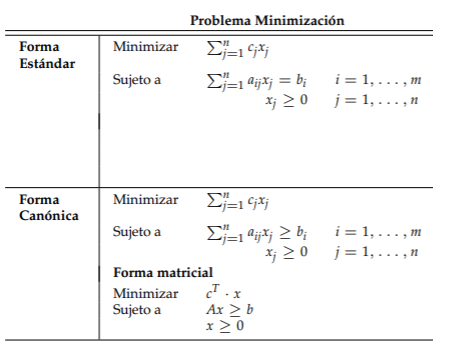

# Hormigas

## Algunos apuntes sobre las hormigas

> [!warning]
> Estos son solo apuntes tomados al chapotear lecturas por varios lados

## Definición ACO

Es un algoritmo de optimización inspirado en el comportamiento de las hormigas cuando buscan comida. Se utiliza para resolver problemas computacionales complejos, como encontrar la ruta más corta en una red (similar al problema del viajante). 

## Aspectos relacionados con la biologia

Las ideas en biologia que se buscan implementar son las siguientes:
1. **El comportamiento individual - ¿Qué hace una sola hormiga cuando busca comida?**
   
   Una hormiga sola actúa de forma muy simple, casi aleatoria. Cuando sale a buscar comida, explora su entorno. Si encuentra una fuente de alimento, toma una porción y emprende el camino de regreso al nido. Mientras regresa, va depositando una sustancia química en el suelo. Su comportamiento es una mezcla de exploración y seguimiento de "pistas".

2. **La comunicación química - ¿Qué son las feromonas y cómo funcionan como "pistas" para las demás?**
   
   Esta es la clave de todo. La sustancia que las hormigas depositan se llama **feromona**. Funciona como un mensaje para las demás. Otras hormigas pueden oler este rastro y decidir seguirlo. Un punto crucial es que la feromona se evapora con el tiempo. Esto significa que los rastros más antiguos o menos usados tienden a desaparecer.

3. **La inteligencia colectiva**: ¿Cómo la suma de comportamientos simples da lugar a una solución inteligente para toda la colonia?
   
   La inteligencia no está en una sola hormiga, sino en el sistema completo. Imagina dos caminos hacia la comida, uno corto y uno largo. Las hormigas que, por azar, toman el camino corto, volverán antes al nido. Esto hace que refuercen ese camino con más feromonas en menos tiempo. El camino corto acumula feromona más rápido de lo que se evapora, volviéndose muy atractivo, mientras que el camino largo se debilita. Al final, toda la colonia prefiere el camino más eficiente sin que nadie lo haya planeado centralmente. Este fenómeno se llama **estigmergia**: una comunicación indirecta a través de modificaciones en el ambiente.

Si yo fuera una hormiga que fuera parte de un nido y necesitara buscar comida sin saber por donde empezar me enfrentaria a un gran problema debido a que:
1. No conozco donde esta la comida.
2. Tengo mucho terreno por explorar y no se por donde empezar ya que no tengo un mapa. Al principio tengo que adivinar practicamente.

Para lograr esto, basicamente sigo dos acciones:
1. **Explorar**: Implica tomar una decisión para elegir que ruta sigo. ¿Esto de que depene?
2. **Comunicarme**: Afortunadamente no soy la unica hormiga, puedo hablar con las otras para que me den pistas evitando tome diferentes caminos. ¿Cuales serian esas pistas?

El mapa inicialmente es desconocido, pero a medida que pasa el tiempo y realizo estas dos acciones empiezo a tener una visión de como este va cambiando gracias a la **estigmergia**. La **estigmergia** es un fenomeno donde los individuos se comunican modificando su entorno (hormigas, cuento de Hansel y Gretel con las migas de comida, etc).

En el caso de las hormigas la **estigmergia** es posible gracias a las **feromonas**. Las **femonas** las cuales son pistas quimicas que se evaporan con el tiempo dejadas por las hormigas para demarcar el camino que recorren.

Cuando hay varias hormigas explorando un territorio en busqueda y cada una deja un rastro que se evapora al pasar, aquellos caminos mas cortos van a ser mas transitados que los caminos mas largos de modo que el rastro se va a reforzar debido a que la cantidad de hormigas que poblemente crucen el camino mas corto sera mayor que el mas largo. Como a mas hormigas mas rastro, se genera un bucle de **retroalimentación positivo** que incide la decisión del camino que tome la hormiga y que en ultimas determina la forma como la colonia descubre el camino, asi:
1. El camino más corto se refuerza mas rapido.
2. Mas hormigas son atraidas por el camino mas fuerte.
3. Al ser usado por mas hormigas, este camino se refuerza aun mas.

Lo anterior fue demostrado por el experimento del **doble puente**:

La siguiente tabla resume los conceptos de biologia que tengo que tener claros antes de pasar a modelar el problema:

| Concepto Biológico | Descripción Clave | Rol Principal en el Algoritmo |
| :--- | :--- | :--- |
| **Agentes (Hormigas)** | Individuos que construyen soluciones con reglas simples y sin una visión global del problema. | Son los encargados de **explorar el espacio de soluciones** y construir las respuestas candidatas. |
| **Feromonas** | Sustancia química que se deposita y se evapora. Funciona como la memoria del sistema. | Es la **información numérica** que indica qué tan buena ha sido una elección en el pasado. |
| **Estigmergia** | Comunicación indirecta. Los agentes modifican el entorno y reaccionan a esas modificaciones. | Es el mecanismo que **guía la búsqueda** de las hormigas, influyendo en sus decisiones futuras. |
| **Retroalimentación positiva (+)** | Los caminos buenos (cortos) se refuerzan más rápido, atrayendo a más agentes. | Es el motor de la **convergencia**, haciendo que el algoritmo se enfoque en las mejores soluciones. |
| **Exploración/Explotación** | Equilibrio entre seguir las rutas conocidas (explotar) y buscar nuevas al azar (explorar). | Permite **evitar soluciones mediocrires** (óptimos locales) y encontrar la solución global. |

> [!tip]
> Preguntas a explorar luego:
> - ¿Que otros aspectos de la biologia de las hormigas se pueden usar fuera de los dos descritos?
> - Mas preguntas que se nos ocurran ...

### Aspectos relacionados con la Matematica

Gracias a la biologia, la hormiga acabo de contar en terminos humanos su historia; sin embargo, a fue [Marco Dorigo](https://en.wikipedia.org/wiki/Marco_Dorigo) que se intereso de alguna manera entendio esta historia e ideo un modelo para describir a lo umano como usando Matematicas y ciencias de la computación las hormigas encuentran la comida y la llevan al nido.

Teniendo en cuenta esto surgen las siguientes preguntas:
- [ ] ¿Como representar el problema? (Estructuras matematicas y de datos)
- [ ] ¿Como llevar lo que hacen todas las hormigas individual y colectivamente a un algoritmo? (procedimiento)
- [ ] ¿Como saber si el modelo esta bueno? (metricas)
- [ ] ¿Que mejoras realizar? (Que mejoras se pueden hacer)

Si nos vamos a las matematicas podemos abordar en dos partes principales:
1. **Exploración**
2. **Comunicación**

#### Representando la exploración

Soy una hormiga, se que por aca hay comida pero no se donde y como llegar asi que me toca explorar. El problema es muy maluco, de modo que voy a restringirlo un poco teniendo en cuenta lo siguiente teniendo en cuenta algunas cosas ideales:
1. Tengo un mapa del camino, por lo menos tengo varios posibles puntos y se como llegar a ellos pues tendo conocimiento de como se conectan.
2. Arranco en uno de los puntos que es el nido (**nest**) para terminar en el de la comida (**food**). Voy a suponer que solo hay comida en un solo punto.
3. Hay muchas caminos por los cuales puedo llevar la comida al nido.
4. Conozco la distancia entre cada uno de los puntos.
5. Una ruta es uno de los caminos que sigo desde el nido hasta la comida.
6. Otros hechos...

La siguiente figura muestra da una idea como plantear mi problema:

Si vemos hay dos elementos principales:
* El mapa
* La hormiga

La pregunta ahora es **¿Como representamos el mapa?**

Como se muestra en la figura el mapa se puede representar como un **grafo $G_C$**  como se ilustra en la siguiente figura (tomada del paper de Dorigo):

Donde:
* **Grafo**: Grafo $G_C(\mathbf{V},\mathbf{E})$
* **Vertices**: Conjunto de vertices (nodos) $V$
* **Links**: Conjunto de enlaces (aristas) entre nodos $E$
* **Solución**: Ruta tomada por las hormigas para llevar la comida. ($\mathbf{C}$). Es decir el conjunto de links que unen los vertices que siguen las hormigas para encontrar la comida. De modo que, el componente $(c_{ij})$ es la elección que hace la hormiga de viajar por esa carretera en particular, en ese momento de la construcción de su ruta.

La representación anterior depende el problema y la disciplina en cuestión.

* **Representación (a)**: Grafo completo (todos los puntos estan conectados) no dirigido ($K_4$)
  * **Vertices (nodos)**: $V={1,2,3,4}$
  * **Aristas (enlaces)**: $E = {(1,2),(1,3),(1,4),(2,3),(2,4),(3,4)}$
  * **Costo de cada arista**: $c_{ij}$

$$
G=(V,E)
$$

* **Representación (b)**: Grafo completo no dirigido ($K_6$)
  * **Vertices (nodos)**: $V'={c_{12},c_{13},c_{14},c_{23},c_{24},c_{34}}$
  * **Aristas (enlaces)**: $E'$ representan la relacion entre pares de componentes. Aqui, la feromona se deposita en las aristas.

Para la representación de un grafo empleamos una matriz de adyacencia. En el caso de las hormigas, la representación sigue la del problema del vendedor viajero emplea dos matrices que las hormigas usan para tomar decisiones:
1. **Matriz de Información Heurística ($\eta$)**: información heurística (qué tan bueno es un camino a simple vista).
   
   La **matriz de visibilidad**, contiene valores estáticos que indican la conveniencia a priori de pasar de un nodo $i$ a un nodo $j$. Para un grafo con $n$ vértices ($|\mathbf{V}∣=n$), la matriz es de $n \times n$. Comúnmente, $\eta_{ij}=1/d_{ij}$, donde $d_{ij}$ es la distancia o costo del enlace $(i,j)$.

$$
\eta = 
\begin{bmatrix}
\eta_{11} & \eta_{12} & \cdots & \eta_{1n} \\
\eta_{21} & \eta_{22} & \cdots & \eta_{2n} \\
\vdots & \vdots & \ddots & \vdots \\
\eta_{n1} & \eta_{n2} & \cdots & \eta_{nn}
\end{bmatrix}
$$

2. **Matriz de Feromonas ($\tau$)**: información de feromonas (qué tan bueno ha resultado ser ese camino en el pasado).

   Esta es la matriz dinámica del algoritmo. Almacena la cantidad de feromona en cada enlace (arista) del grafo. A diferencia de la matriz heurística, los valores de esta matriz **cambian** en cada iteración del algoritmo debido a la evaporación y al depósito de nueva feromona por parte de las hormigas.

$$
\tau(t) = 
\begin{bmatrix}
\tau_{11}(t) & \tau_{12}(t) & \cdots & \tau_{1n}(t) \\
\tau_{21}(t) & \tau_{22}(t) & \cdots & \tau_{2n}(t) \\
\vdots & \vdots & \ddots & \vdots \\
\tau_{n1}(t) & \tau_{n2}(t) & \cdots & \tau_{nn}(t)
\end{bmatrix}
$$

  Donde $(t)$ indica el valor de la feromona en la iteración o tiempo $t$

#### Representando la comunicación

Recordemos que la comunicación entre las hormigas de la colonia es posible gracias a la **estigmergia**. En la **estigmergia** las hormigas no se comunican entre sí directamente, sino que lo hacen modificando el entorno, y las otras hormigas reaccionan a ese entorno modificado.

La comunicación se representa mediante la matriz de feromonas $\tau(t)$ (previamente mencionada).

Una de las cosas que tiene que hacer una hormiga es decidir cual de los posibles caminos seguir. Para la selección la hormiga ha de tener en cuenta las feromonas:

Esta elección se puede representar por la siguiente probabilidad de una hormiga $k$ que esta en el nodo $i$ seleccione el nodo $j$ esta dada por:

$$
p_{ij}^{k} = 
\begin{cases} 
\frac{\tau_{ij}^{\alpha} \cdot \eta_{ij}^{\beta}}{\sum_{c_{il} \in N(s^p)} \tau_{il}^{\alpha} \cdot \eta_{il}^{\beta}} & \text{if } c_{ij} \in N(s^p), \\
0 & \text{otherwise,} 
\end{cases}
$$

En lo que respecta al **numerador**, este dice que tan **atractivo** es el camino en cuestion, por eso se le conoce como **componente atractivo**:

$$
\tau_{ij}^{\alpha} \cdot \eta_{ij}^{\beta}
$$

Este tiene los siguientes compontentes:

* **Feromona $(\tau_{ij})$**: La cantidad de feromona en el camino entre $i$ y $j$. **Experiencia colectiva**:  ¿qué tan bueno ha sido este camino para otras hormigas en el pasado?
* **Información Heurística $(\eta_{ij})$**: Una medida de qué tan bueno parece el camino a priori. Generalmente es $1/d_{ij}$. **Logica local**: Un camino mas corto es mas deseable
* **Importancia de la Feromona $(\alpha)$**: Un parámetro que controla la influencia del rastro de feromonas.
* **Importancia de la Heurística $(\beta)$**: Un parámetro que controla la influencia de la distancia.

Los parametros $\alpha$ y $\beta$ determinan cual de los dos elementos (feromona o heuristica) que inciden en la decisión de las hormigas tiene mas peso.

La parte del **denominador** es la que normaliza la expresión:

$$
\sum_{c_{il} \in N(s^p)} \tau_{il}^{\alpha} \cdot \eta_{il}^{\beta}
$$

Donde:
* **Suma de los puntajes de atracción de todos los caminos conectados al nodo $i$ $(\sum)$**.
* **Indice para los vecidos de $i$ $(l)$**
* **Vecindario Factible	$(N(s^p))$**: Representa el **conjunto de movimientos permitidos** para la hormiga. En otras palabras, aquellos lugares que la hormiga $k$ **aun no ha visitado**.

La expresión $if c_{ij} ∈ N(s^p)$ se traduce como: "Si la elección de ir de $i$ a $j$ pertenece al conjunto de movimientos permitidos...". Es una manera formal de asegurarse de que la hormiga solo considere caminos válidos para su siguiente paso.

#### Definición formal de un problema de optimización combinatoria

Formula matemática para describir cualquier problema en el que se busca la mejor solución entre un número finito de posibilidades.

Componentes:
1. Espacio de busqueda $(S)$
2. Conjunto de restricciones $(\Omega)$
3. Funcion objetivo $(f)$

Finalmente, la solución óptima global $(s^*)$ es aquella solución factible cuyo valor, según la función objetivo, es mejor o igual que el de cualquier otra solución posible en todo el espacio de búsqueda.

* **Ejemplo**: ¿Cual seria la representación a 4 ciudades? empleando la receta anterior?

Volvamos al mapa:

**Elementos basicos del problema**

1. **Ciudades**: $V={1,2,3,4}$
2. **Distancias**: Matriz de distancias $d_{ij}$ que nos da el costo de viajar de la ciudad $i$ a la ciudad $j$.

**Representación del problema usando la notación $P(S,\Omega,f)$**

1. **Espacio de Búsqueda $(S)$**: todas las posibles rutas, sin importar si son válidas o no.
   * **Variables de decisión (X_i)**: Ciudad recorrida en la posición $i$ en el viaje.
     * **$X_1$**: La primera ciudad en la ruta. 
     * **$X_2$**: La segunda ciudad en la ruta. 
     * **$X_3$**: La tercera ciudad en la ruta. 
     * **$X_4$**: La cuarta ciudad en la ruta. 
   * **Dominio de las variables**: $X_i \in \{1,2,3,4\}$
   * **Espacio de Búsqueda $(S)$**: Una posible solución $s$ es una secuencia $(x_1,x_2,x_3,x_4)$ es una recuencia que representa un orden para visitar las ciudades. Por lo tanto $S$ es el conjunto de **todas las permutaciones** de las 4 ciudades. Por ejemplo una posible solucion es $s=(3,1,2,4)$. El tamaño de $S$ son todas las rutas posibles es $n!=4!=24$
2. **Restricciones $(\Omega)$**: Reglas que una ruta debe seguir para ser válida.
   * Cada ciudad debe ser visitada **exactamente una vez**.
   
   Cada ruta posible $s$ cumple la restricción, por lo tanto todas las soluciones en $S$ son **factibles**.
3. **Función objetivo $(f)$**: calcula el **costo total** de una ruta determinada. El objetivo es minimizar este valor.
   * **Cálculo de la Función**: Para una solución $s=(x_1, x_2, x_3, x_4)$, la función $f(s)$ suma las distancias entre ciudades consecutivas y, fundamentalmente, la distancia para volver al punto de partida.

$$
f(x) = d_{x_{1},x_{2}} + d_{x_{2},x_{3}} + d_{x_{3},x_{4}} + d_{x_{4},x_{1}}
$$
   
   * **Meta**:  Encontrar la solución óptima global $s^*$ tal que su costo $f(s^∗)$ sea el más bajo de todas las 24 posibles rutas en $S$.
  

## Planteamiento del problema

### Representacion estandar

---
**Minimizar**:

$$
Z = \sum_{i=1}^{4} \sum_{j=1, j\neq i}^{4} d_{ij} \cdot x_{ij}
$$

**Sujeto a**

1. Restriciones de entrad y salida

$$
\sum_{j=1, j\neq i}^{4} x_{ij} = 1 \quad \text{para } i \in \{1, 2, 3, 4\}
$$

$$
\sum_{i=1, i\neq j}^{4} x_{ij} = 1 \quad \text{para } j \in \{1, 2, 3, 4\}
$$

2. Eliminacion de subtours

$$
\left( \sum_{i \in S} \sum_{j \notin S} x_{ij} \right) - s_S = 1 \quad \forall S \subset V, S \neq \emptyset
$$

3. No negatividad

$$
x_{ij} \ge 0
$$

$$
s_S \ge 0
$$
---

**Nota**: La variable $s_S$ representa el número de caminos "extra" por encima del mínimo requerido de $1$.

Por ejemplo, si para un grupo de ciudades $S$ hay 3 caminos que lo conectan con el exterior, la suma sería 3. Para que la ecuación se cumpla, $s_S$ tendría que valer 2 (es decir, 3−2=1).

El subíndice $S$ indica que hay una variable de excedente única y diferente para cada posible subconjunto S de ciudades.

La forma matricial queda....

Pendiente...

### Representacion canonica

1. **Minimizad la Funcion objetivo**: 

$$
Z = \sum_{i=1}^{4} \sum_{j=1, j\neq i}^{4} d_{ij} \cdot x_{ij}
$$

2. **Sujeto a**:
   
* **Restricciones de salida $(\sum{x_{ij}}=1)$**: Estas aseguran que cada ciudad se abandona una sola vez.

$$
\sum_{j=1, j\neq i}^{4} x_{ij} \ge 1 \quad \text{para } i \in \{1, 2, 3, 4\}
$$

$$
\sum_{j=1, j\neq i}^{4} -x_{ij} \ge -1 \quad \text{para } i \in \{1, 2, 3, 4\}$$

   
   * **Restricciones de entrada $(\sum{x_{ij}}=1)$**: Estas aseguran que a cada ciudad se llega una sola vez.
   
$$
\sum_{i=1, i\neq j}^{4} x_{ij} \ge 1 \quad \text{para } j \in \{1, 2, 3, 4\}
$$

$$
\sum_{i=1, i\neq j}^{4} -x_{ij} \ge -1 \quad \text{para } j \in \{1, 2, 3, 4\}
$$

3. **Eliminación de Sub-tours**: restricción que garantiza una única ruta conectada.

$$
\sum_{i \in S} \sum_{j \notin S} x_{ij} \ge 1 \quad \forall S \subset V, S \neq \emptyset
$$

4. **No Negatividad de las Variables**: 

$$x_{ij} \ge 0$$

Las variables $x_{ij}$ son binarias, $x_{ij} \in \{0,1\}$, lo cual hace que cumplan la condicion de no negatividad

En resumen se pide:

**Minimizar**:

$$
Z = \sum_{i=1}^{4} \sum_{j=1, j\neq i}^{4} d_{ij} \cdot x_{ij}
$$

**Sujeto a**:

$$
\sum_{j=1, j\neq i}^{4} x_{ij} \ge 1 \quad \text{para } i \in \{1, 2, 3, 4\}
$$

$$
\sum_{j=1, j\neq i}^{4} -x_{ij} \ge -1 \quad \text{para } i \in \{1, 2, 3, 4\}$$

$$
\sum_{i=1, i\neq j}^{4} x_{ij} \ge 1 \quad \text{para } j \in \{1, 2, 3, 4\}
$$

$$
\sum_{i=1, i\neq j}^{4} -x_{ij} \ge -1 \quad \text{para } j \in \{1, 2, 3, 4\}
$$

$$
\sum_{i \in S} \sum_{j \notin S} x_{ij} \ge 1 \quad \forall S \subset V, S \neq \emptyset
$$

$$
x_{ij} \ge 0
$$

La forma matricial de lo anterior sigue el siguiente formado:

**Vector de variables de decisión**:

$$
\mathbf{x} = 
\begin{bmatrix}
x_{12} \\ x_{13} \\ x_{14} \\ x_{21} \\ x_{23} \\ x_{24} \\ x_{31} \\ x_{32} \\ x_{34} \\ x_{41} \\ x_{42} \\ x_{43}
\end{bmatrix}
$$

**Vector de costos transpuestos**

$$
\mathbf{c}^T = 
\begin{bmatrix}
d_{12} & d_{13} & d_{14} & d_{21} & d_{23} & d_{24} & d_{31} & d_{32} & d_{34} & d_{41} & d_{42} & d_{43}
\end{bmatrix}
$$
**Vector b**

$$
\mathbf{b} = 
\begin{bmatrix}
1 \\ -1 \\ 1 \\ -1 \\ 1 \\ -1 \\ 1 \\ -1 \\ \hline 1 \\ -1 \\ 1 \\ -1 \\ 1 \\ -1 \\ 1 \\ -1
\end{bmatrix}
$$

**Matriz A**:

$$
\mathbf{A} = 
\begin{bmatrix}
% Salir de 1 (>= y <=)
1 & 1 & 1 & 0 & 0 & 0 & 0 & 0 & 0 & 0 & 0 & 0 \\
-1 & -1 & -1 & 0 & 0 & 0 & 0 & 0 & 0 & 0 & 0 & 0 \\
% Salir de 2 (>= y <=)
0 & 0 & 0 & 1 & 1 & 1 & 0 & 0 & 0 & 0 & 0 & 0 \\
0 & 0 & 0 & -1 & -1 & -1 & 0 & 0 & 0 & 0 & 0 & 0 \\
% Salir de 3 (>= y <=)
0 & 0 & 0 & 0 & 0 & 0 & 1 & 1 & 1 & 0 & 0 & 0 \\
0 & 0 & 0 & 0 & 0 & 0 & -1 & -1 & -1 & 0 & 0 & 0 \\
% Salir de 4 (>= y <=)
0 & 0 & 0 & 0 & 0 & 0 & 0 & 0 & 0 & 1 & 1 & 1 \\
0 & 0 & 0 & 0 & 0 & 0 & 0 & 0 & 0 & -1 & -1 & -1 \\
\hline
% Entrar a 1 (>= y <=)
0 & 0 & 0 & 1 & 0 & 0 & 1 & 0 & 0 & 1 & 0 & 0 \\
0 & 0 & 0 & -1 & 0 & 0 & -1 & 0 & 0 & -1 & 0 & 0 \\
% Entrar a 2 (>= y <=)
1 & 0 & 0 & 0 & 0 & 0 & 0 & 1 & 0 & 0 & 1 & 0 \\
-1 & 0 & 0 & 0 & 0 & 0 & 0 & -1 & 0 & 0 & -1 & 0 \\
% Entrar a 3 (>= y <=)
0 & 1 & 0 & 0 & 1 & 0 & 0 & 0 & 0 & 0 & 0 & 1 \\
0 & -1 & 0 & 0 & -1 & 0 & 0 & 0 & 0 & 0 & 0 & -1 \\
% Entrar a 4 (>= y <=)
0 & 0 & 1 & 0 & 0 & 1 & 0 & 0 & 1 & 0 & 0 & 0 \\
0 & 0 & -1 & 0 & 0 & -1 & 0 & 0 & -1 & 0 & 0 & 0
\end{bmatrix}
$$

> [!tip]
> * La parte superior de la matriz (A) y del vector (b) corresponde a las 8 restricciones de salida (las reglas para abandonar cada una de las 4 ciudades).
> * La parte inferior corresponde a las 8 restricciones de entrada (las reglas para llegar a cada una de las 4 ciudades).