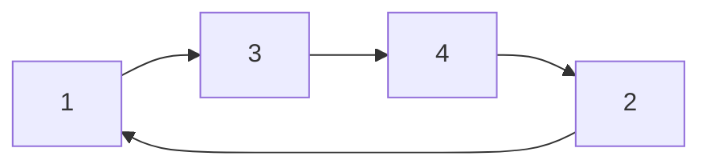

# TSP

## Un problema de optimización combinatoria

Un modelo $P = (S, \Omega, f)$ de un problema de optimización combinatoria consiste en:

* Un espacio de búsqueda $S$ definido sobre un conjunto finito de variables de decisión discretas $X_i$, $i=1, \dots, n$;
* Un conjunto $\Omega$ de restricciones entre las variables; y
* Una función objetivo $f: S \to \mathbb{R}_0^+$ a ser minimizada.

La variable genérica $X_i$ toma valores en $D_i = \{v_i^1, \dots, v_i^{|D_i|}\}$. Una solución factible $s \in S$ es una asignación completa de valores a las variables que satisface todas las restricciones en $\Omega$.

Una solución $s^* \in S$ se denomina óptimo global si y solo si:

$$f(s^*) \le f(s) \; \forall s \in S$$

## Problema TSP

> [!note]
> Es importante al principio lograr manejar una notación clara, por lo tanto antes de seguir vamos a intentar realizar la notacién del problema de la forma mas clara posible.

### Sobre el problema

### Planteamiento del problema TSP

Vamos a proceder a plantear el problema del TSP como un problema de optimizacion combinatoria $(P = (S, \Omega, f))$ siguiendo el formato anterior:

> **Nota**: Empecemos el planteamiento con 4 ciudades.

**1. Espacio de busqueda $(S)$** 

**S**: Grafo dirigido con todas las posibles rutas, validas y no que puede tomar el vendedor. $S \in \mathbb{R}^{4}$

$$
S = \begin{bmatrix}
x_{11} & x_{12} & x_{13} & x_{14} \\
x_{21} & x_{22} & x_{23} & x_{24} \\
x_{31} & x_{32} & x_{33} & x_{34} \\
x_{41} & x_{42} & x_{43} & x_{44} \\
\end{bmatrix}
\quad \text{donde } x_{ij} \in \left\{0, 1\right\}
$$

Por ejemplo, una posible solucion una ruta como la siguiente: $1 \to 3 \to 4 \to 2 \to 1$ lo cual implica que: $x_{13}=1, x_{34}=1, x_{42}=1, x_{21}=1$ es decir:

Lo cual se representa en la siguiente matriz:

$$
X = \begin{bmatrix}
0 & 0 & 1 & 0 \\
1 & 0 & 0 & 0 \\
0 & 0 & 0 & 1 \\
0 & 1 & 0 & 0 \\
\end{bmatrix}
$$

Por lo tanto, para este problema, en general $X$ es una matriz binaria de $4\times4$

$$
X \in \left\{0, 1\right\}^{4 \times 4}
$$

La matrix $X$ puede ser vista como un conjunto de vectores fila:

$$
X = \begin{bmatrix}
r_1 \\
r_2 \\
\vdots \\
r_n
\end{bmatrix}
\quad \text{donde } r_i = [x_{i1}, x_{i2}, \dots, x_{in}]
$$

Para el caso del problema tenemos:

$$
X = \begin{bmatrix}
\leftarrow r_1 \rightarrow \\
\leftarrow r_2 \rightarrow \\
\leftarrow r_3 \rightarrow \\
\leftarrow r_4 \rightarrow
\end{bmatrix}
$$

Con $X_i = r_i$ tenemos que:
- **$1\to 3$**: $X_1 = r_1 = [0,0,1,0]$
- **$2\to 1$**: $X_2 = r_2 = [1,0,0,0]$
- **$3\to 4$**: $X_3 = r_3 = [0,0,0,1]$
- **$4\to 2$**: $X_4 = r_4 = [0,1,0,0]$

Luego en este contexto:

$$
X = \begin{bmatrix}
X_1 \\
X_2 \\
X_3 \\
X_4
\end{bmatrix} = \begin{bmatrix}
\leftarrow r_1 \rightarrow \\
\leftarrow r_2 \rightarrow \\
\leftarrow r_3 \rightarrow \\
\leftarrow r_4 \rightarrow
\end{bmatrix}
$$

Donde cada $X_i$ es un vector binario de cuatro elementos: $X_i \in \left\{0,1\right\}^4$ y por lo tanto $X$ sera un vector de vectores donde se representa la matriz de adyacencias de una forma plana:

$$
X=[X_1, X_2, X_3, X_4]
$$

Representando la matriz $X$ en forma vectorizada (aplanada):

$$
x=[0,0,1,0,1,0,0,0,0,0,0,1,0,1,0,0]
$$

donde $x\in\left\{0,1\right\}^{n^2}$, es decir $x\in\{0,1\}^{16}$

Finalmente, la ultima forma de representación es por medio de un **vector de ruta (Permutacion) $P = [\pi_1,\pi_2,...,\pi_n]$**, donde para este caso la ruta $1 \to 3 \to 4 \to 2 \to 1$ esta dada por el vector $P$:

$$
P=[1,3,4,2]
$$

Finalmente, tambien podemos referirnos a $X$ como un vector de permutación $P$, donde cada $X_i$ se asocia a la ciudad (numero entero) visitada en el paso $i$ del tour. Es decir:
- $X_1$: Primera ciudad visitada.
- $X_2$: Segunda ciudad visitada.
- $X_3$: Tercera ciudad visitada.
- $X_4$: Cuarta ciudad visitada.

De modo que para la ruta: $1 \to 3 \to 4 \to 2 \to 1$, el vector $X$ seria el vector de enteros: $X=[1,3,4,2]$ siendo para esta definición cada $X_i$:

$$
X_i\in\left\{1,2,3,4\right\}
$$

**2. Funcion objetivo $(f)$**

Aca vamos...

$$
x_{ij} = \begin{cases}
  1 & \text{si la ruta } (i, j) \text{ es parte del tour} \\
  0 & \text{en caso contrario}
\end{cases}
$$

