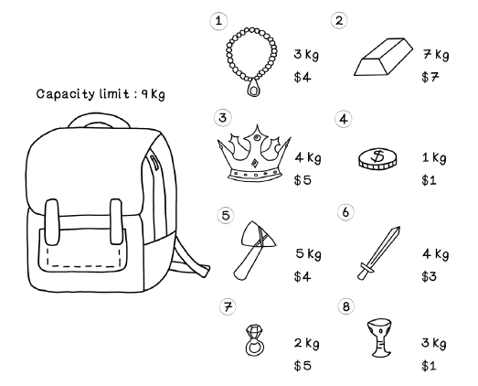
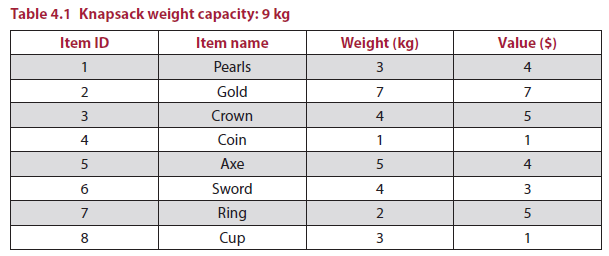
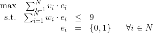

### Knapsack Problem (Problema de la mochila)

Considerando el problema de la mochila, en el cual, una mochila tiene un peso máximo específico que puede soportar. Si se tienen varios articulos de diferentes valores y pesos y lo que se desea es cargar la mochila de tal manera que el valor total de los articulos cargados sea maximo pero que el peso maximo de estos no supere al peso maximo que la mochila puede soportar (según la grafica es de 9 kg) tal y como se muestra en la siguiente figura:

La siguiente tabla muestra el problema del bolso:

#### Planteamiento del problema

**Definicion del las variables**

* **Elemento (binario) i-esimo a llevar**: $e_i$
* **Valor del elemento-iesimo**: $v_i$
* **Peso del elemento del elemento-iesimo**: $w_i$
* **Pesos de los difetentes elementos**: $\textbf{w} = [
3 , 7  , 4  , 1  , 5 , 4 , 2 , 3 ]$
* **Valores de los difetentes elementos**: $\textbf{v} = [4 , 7  , 5  , 1  , 4 , 3 , 5 , 1 ]$
* **Tipos de elementos**: $\textbf{t} = [\text{Pearls} , \text{Gold} , \text{Crown} , \text{Coin} , \text{Axe} , \text{Sword} , \text{Ring} , \text{Cup} ]$

**Planteamiento del problema**

<!--
$\begin{array}{rrclcl}
\displaystyle \text{max} & {\sum_{i=1}^{N}v_i\cdot e_i} \\
\textrm{s.t.} & \sum_{i=1}^{N}w_i\cdot e_i & \leq & 9 \\
& e_i & = & \{0,1\} & & \forall i \in N \\
\end{array}$
-->

## Soluciones en diferentes lenguajes

1. Mochila en python ([link](sol_python/README.md))
2. Mochila en minizinc

## Referencias

1. https://github.com/cjbt/Free-Algorithm-Books/tree/master/book
2. https://github.com/egonSchiele/grokking_algorithms
3. https://github.com/rishal-hurbans/Grokking-Artificial-Intelligence-Algorithms
4. http://am121.seas.harvard.edu/site/wp-content/uploads/2014/08/latex_snippets.pdf
5. https://orcomplete.com/computer/sertalpbilal/latex-templates-for-optimization-models
6. https://ashki23.github.io/markdown-latex.html