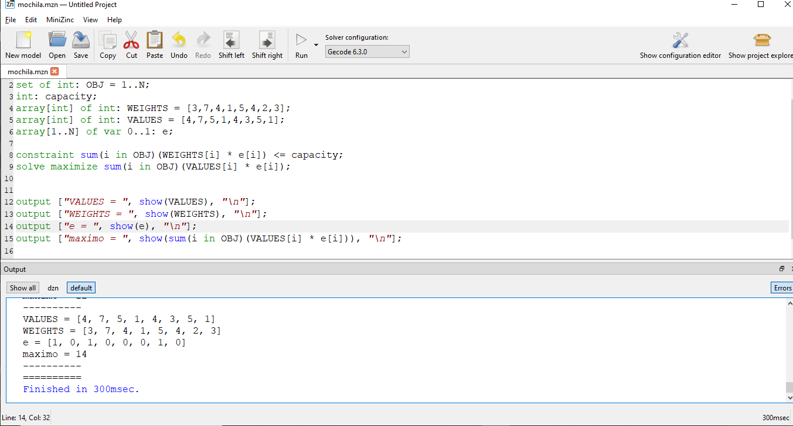

# Solucion en minizinc

La solución en minizinc se encuentra confificada en el archivo [mochila.mzn](mochila.mzn) tal y como se muestra en la siguiente grafica:



La salida se copio mostrando el siguiente resultad:

```
Running mochila.mzn
300msec

VALUES = [4, 7, 5, 1, 4, 3, 5, 1]
WEIGHTS = [3, 7, 4, 1, 5, 4, 2, 3]
e = [0, 0, 0, 0, 0, 0, 0, 0]
maximo = 0
----------
VALUES = [4, 7, 5, 1, 4, 3, 5, 1]
WEIGHTS = [3, 7, 4, 1, 5, 4, 2, 3]
e = [1, 0, 0, 0, 0, 0, 0, 0]
maximo = 4
----------
VALUES = [4, 7, 5, 1, 4, 3, 5, 1]
WEIGHTS = [3, 7, 4, 1, 5, 4, 2, 3]
e = [0, 1, 0, 0, 0, 0, 0, 0]
maximo = 7
----------
VALUES = [4, 7, 5, 1, 4, 3, 5, 1]
WEIGHTS = [3, 7, 4, 1, 5, 4, 2, 3]
e = [1, 0, 1, 0, 0, 0, 0, 0]
maximo = 9
----------
VALUES = [4, 7, 5, 1, 4, 3, 5, 1]
WEIGHTS = [3, 7, 4, 1, 5, 4, 2, 3]
e = [1, 0, 1, 1, 0, 0, 0, 0]
maximo = 10
----------
VALUES = [4, 7, 5, 1, 4, 3, 5, 1]
WEIGHTS = [3, 7, 4, 1, 5, 4, 2, 3]
e = [0, 1, 0, 0, 0, 0, 1, 0]
maximo = 12
----------
VALUES = [4, 7, 5, 1, 4, 3, 5, 1]
WEIGHTS = [3, 7, 4, 1, 5, 4, 2, 3]
e = [1, 0, 1, 0, 0, 0, 1, 0]
maximo = 14
----------
==========
Finished in 300msec.
```

De modo que la respuesta de los items seleccionados será:

|Item ID|Item Name|Weight (kg)|Value ($)|
|---|---|---|---|
|1|Pearls|3|4|
|3|Crown|4|5|
|7|Ring|2|5|
